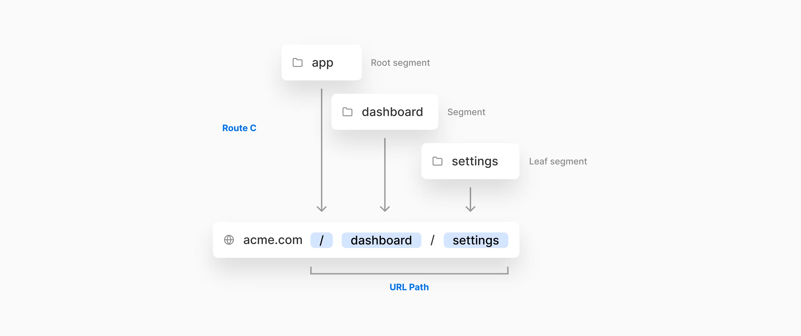
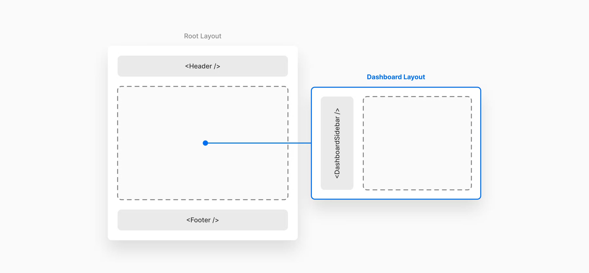

# Page

## 용어정리

- getStaticProps (Static Site Generation)
  - 해당 함수를 부른 페이지는 빌드타임때 props를 받아 정적 페이지로 만든다.
  - `next build` 과정에서 실행된다.
  - 생성된 HTML, JSON 파일은 CDN에 의해 캐싱 될 수 있음
  - SEO를 위해 사전 렌더링이 필요하거나 매우 빨라야할때 사용함.
- getServerSideProps
  - 요청 받을 때 실행된다.
  - `next/link` 또는 `next/router`를 통해 클라이언트에서 전환한 페이지가 해당 함수를 가지고 있다면 Next.js가 Server로 API 를 요청한다.
  - Request를 보낼 때 마다 다른 결과를 가져와야 하는 페이지라면 해당 함수를 사용해야한다.
- hydration
  - 한국어 : 수분 보충
  - 서버에서 렌더링되는 컴포넌트 (SSR과는 조금 다름)
  - TTI (Time To Interaction)
  - TTV (Time To View)

`pages/post/[id].jsx`

```jsx
// pages/post/DetailPost.jsx
const Page = () => {
  return (
    <Layout>
      <Component />
    </Layout>
  );
};

// pages/post/DetailPost2.jsx
const Page2 = () => {
  return (
    <Layout>
      <Component2 />
    </Layout>
  );
};
```

## [Layout RFC](https://nextjs.org/blog/layouts-rfc)

> 💡 RFC(Request of Comment)는 비평(피드백)을 기다린다는 뜻으로 <br/>
> 컴퓨터 공학에 적용 가능한 새로운 연구, 혁신, 기법등을 아우르는 메모이다. <br/>
> 확정되어 출시된 기능은 아니며 개념적인 부분을 다룬다. <br/>

Next.js에서는 꽤나 최근인 지난 5월에 발표한 내용이다.

현재 Next.js 라우팅의 한계점을에 대해 피드백을 모았는데 아래와 같은 결과가 있었다.

- 레이아웃을 만드는 개발자 경험이 향상될 수 있다. 중첩되고 경로 간에 공유되며 탐색 시 상태를 보존할 수 있는 레이아웃을 쉽게 작성할 수 있어야 합니다.
- 많은 Next.js 응용 프로그램은 대시보드 또는 콘솔로, 보다 고급 라우팅 솔루션의 이점을 얻을 수 있습니다.

개인적인 생각으로는 같은 레이아웃을 여러 페이지에서 공유하면서 쓸 수 있도록 SPA환경에 대한 이점을 극한으로 끌어올리고 싶은 생각 같다. GNB레이아웃이나 기타 하위 세그먼트에 동일하게 적용되는 레이아웃을 `layout.js` 라는 컨벤션으로 분리했다고 본다.

React v18의 변경사항을 적용하면서 새로운 라우팅 방식을 적용한다.

기존에는 `pages` 디렉토리의 개별 폴더 및 파일명을 URL을 통해 엑세스하는 방식으로 라우팅을 진행했다.

![과거 Next.js 라우팅 방식 [출처 : Next.js Document]](./images/page_layout_01-1.png)

과거 Next.js 라우팅 방식 [출처 : Next.js Document]

- Dyanimic path : `[param].js, [...param].js, [[...param]].js`
- Layout : 간단한 component-based layout 지원. 등
- Data Fetching: `getStaticProps, getServerSideProps`

이런 시스템에서 Next.js는 어떤 점을 개선했는지 알아보자

- `app` 디렉토리
  - 기존에는 `pages` 디렉토리로 라우팅이 되었는데 `app` 이라는 디렉토리 이름이 추가되었다
  - `pages` 디렉토리 처럼 폴더, 파일 명 기반으로 라우팅됨
  - app, pages 폴더에 만약 동일한 경로 (파일) 이 존재하면 어떤걸 우선순위로 가지고 라우팅을 해 줄 것인가? \*
  - 어떤 경우에 app 디렉토리를 사용하는가? \*
- `layout.js` 규칙 추가

  1. 세그먼트 경로간 공유되는 UI

     

  2. 두가지 종류

     1. 루트 레이아웃 : 모든 경로에 적용 (`app/layout.js`)

        1. 보통 `_app.js` 에서 전체적으로 감싸주었는데 이제는 `layout.js` 파일에서 담당하게 됨

           ```jsx
           //root layout
           const RootLayout = ({ children }) => (
             <GNBLayout>{children}</GNBLayout>
           );

           export default RootLayout;
           ```

     2. 일반 레이아웃 : 특정 경로에 적용 ( `app/*/layout.js` )

        

        1. 루트 레이아웃을 적용했다면 페이지의 하위 세그먼트에 적용된 `layout.js` 도 위처럼 적용된다.

- `pages` 디렉토리

  - 라우팅과 직접적인 연관이 있었기 때문에 [pageExtentions config](https://nextjs.org/docs/basic-features/layouts#per-page-layouts) 없이는 페이지 라우팅 이외의 파일은 둘 수 없었는데, 이제는 가능하다.

    ```jsx
    /pages/dashboard/index.js
    /pages/dashboard/config.js
    /pages/dashboard/jest.js

    /dashboard/config.js * // 어떤 파일명이 추가로 올 수 있는지, routing은 어떻게 되는지 확인
    ```

  - `layout.js` 규칙이 동일하게 적용된다.

- React Server Component

  - SSR이랑은 다른 개념임 ([toast ui](https://ui.toast.com/weekly-pick/ko_20210119))
  - [react hydration](https://velog.io/@huurray/React-Hydration-%EC%97%90-%EB%8C%80%ED%95%98%EC%97%AC)
    [zero-bundle-size react server components](https://reactjs.org/blog/2020/12/21/data-fetching-with-react-server-components.html)
    [RFC](https://github.com/reactjs/rfcs/blob/bf51f8755ddb38d92e23ad415fc4e3c02b95b331/text/0000-server-components.md)
    왜 필요했는가
  - 그동안 React는 앱이 클라이언트 중심적이였고 서버를 충분히 활용하지 못했기 떄문에 서버를 사용했을 때 얻을 수 있는 여러 이점들을 얻지 못했음.
  - 따라서 React에서 서버를 적극적으로 활용할 수 있도록 기능화시켜야함
    무엇을 해결할것인가
  - 개발자들이 “pit of success”에 빠지면 좋겠다. (react를 개발하기 더 쉬웠으면 좋겠다?)
  - Data Fetch가 좀더 위웠으면 좋겠다
    무엇을 바꾸었나
  - zero-bundle-size component ???

  > `pages` 와 `apps` 의 가장 큰 변경점은 `app` 폴더 안에 있는 파일들이 React Server Components로 렌더링 된다는 사실이다.<br/>
  > 따라서 `pages` → `app` 폴더로 마이그레이션하면 자동으로 React Server Components를 적용해준다는 말이다.
